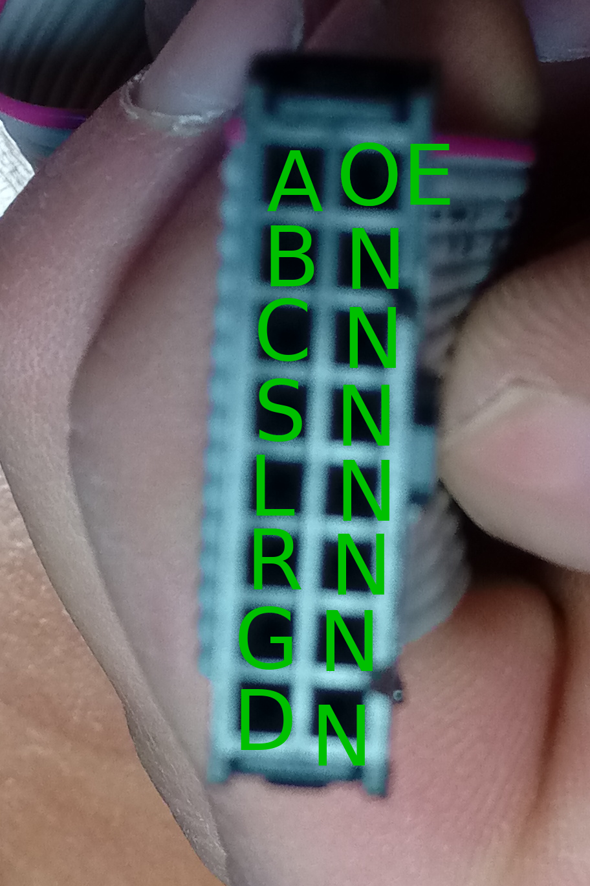


# Garden Monitor
A useful monitor for garden displaying information on dot-matrix

# Terminal Commands

|Format|Description|Details|
|--|--|--|
|`#TYYMMDDDwHHmmSS`|Setting time|`#T19052405180500`.  `Dw` - day of week, Monday - `01`, Sunday - `07`|
|`#R`|I noticed that restart does not work if I do this just after sketch uploading. I have to do at least once manual reset for this function to work.|
|`#BNNN`|Setting brightness|NNN - are 3 digits. Use 015 for 15. The value between 000 and 255|
|`#KSNNN`|Sends current temperature from sensor|NNN - are 3 digits. Use 015 for 15. S - sign "-" or "+"|
|`#CNNNMMM`|Sets temperature correction parameters|NNN and MMM - are bytes B and K. Example `#C128098`|

# Hardware

I played with different controllers. P10 screen works with operating voltage 5V so only Anrduino Uno worked fine.

## [RTC](https://www.makeuseof.com/tag/how-and-why-to-add-a-real-time-clock-to-arduino/)

* [DS3231 Library](https://github.com/NorthernWidget/DS3231

## DHT22
Temperature and humidity sensor
* [DHT Library](https://github.com/adafruit/DHT-sensor-library)

## P10 Dot-Matrix display
 * [DMD2 Library](https://github.com/freetronics/DMD2)
 * [Instructable article](http://www.instructables.com/id/Display-Text-at-P10-LED-Display-Using-Arduino/)
 * [Linking dot matrix to Arduino](https://maker.pro/projects/arduino/arduino-led-matrix-controlled-android-app-greenpaks-i2c)
 *  [Font creator (Java based, use GLCDFontCreator2.zip)](https://code.google.com/archive/p/glcd-arduino/downloads)
	 * Running FontCreator:  `java -classpath . FontCreator`

### Wiring
Because BLE shield and DMD conflict for pins I used not standard DMD pins (`Arduino(Def)`) but custom (`Arduino(My)`)

|Letter|Meaning|Wire|Arduino(Def)|Arduino(My)|ESP8266|D1/R1|
|--|--|--|--|--|--|--|
|OE|NOE|White|D9|D10|GPIO15|D8|
|A|A|Purple|D6|D7|GPIO16|D2|
|B|B|Orange|D7|D6|GPIO12|D6|
|S|sck|Green|D13|D5|GPIO14|D5|
|L|clk|Yellow|D8|D4|GPIO0|D10|
|R|R|Blue|D11|D3|GPIO13|D7|

### Bus mapping

[Connecting to ESP8266](http://forum.freetronics.com/viewtopic.php?t=6687)

## BLE Shield
 * [Library](https://github.com/RedBearLab/nRF8001)

## Other hardware
### [The 74HC595 Shift Register](https://learn.adafruit.com/adafruit-arduino-lesson-4-eight-leds/the-74hc595-shift-register)

### [Wemos D1/R1 Controller](https://wiki.wemos.cc/products:d1:d1)

 * [Mapping GPIOs to Ds](https://jardikblog.wordpress.com/2016/11/02/wemos-d1-r1-vs-wemos-d1-r2/)
 * [How to Program ESP8266 with Arduino UNO](https://www.hackster.io/harshmangukiya/how-to-program-esp8266-with-arduino-uno-efb05f)

|Arduino|D1/R1 label|GPIO|
|--|--|--|
|D2|TX1/D9|GPIO2|
|D6|D2|GPIO16|
|D7|D12/MISO/D6|GPIO12|
|D8|D10/SS|GPIO15|
|D9|D8|GPIO0|
|D11|D11/MOSI/D7|GPIO13|
|D13|D13/SCK/D5|GPIO14|
|A4|D14/SDA/D4|GPIO4|
|A5|D15/SCL/D3|GPIO5|

#### Libraries
##### [WiFiManager](https://github.com/tzapu/WiFiManager)
##### [NTPClient](https://github.com/arduino-libraries/NTPClient)
##### [ArduinoJson](https://github.com/bblanchon/ArduinoJson)
  
# Accuweather
* [Request for current weather condition](https://developer.accuweather.com/accuweather-current-conditions-api/apis/get/currentconditions/v1/%7BlocationKey%7D)
* Kyiv location key: 324505
# Others
 * [Online Markdown editor](https://stackedit.io)
