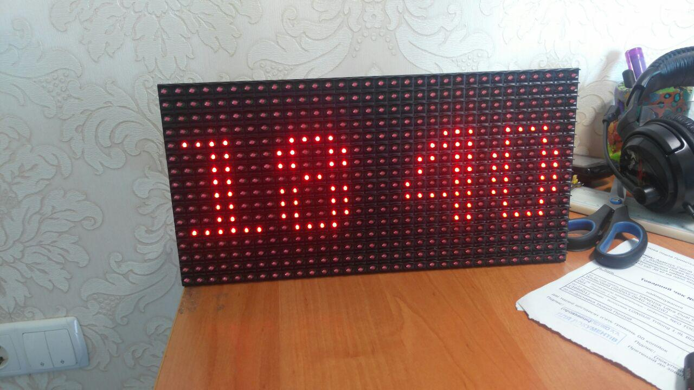
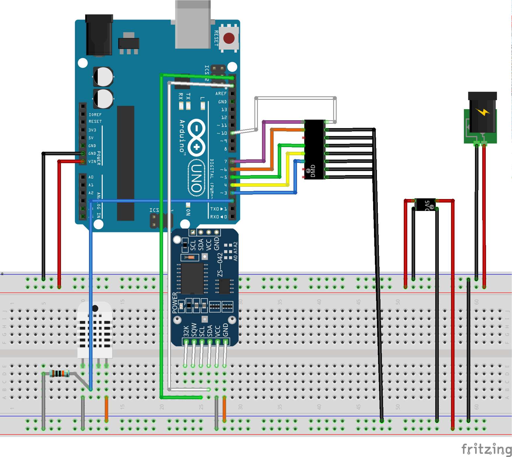


# Garden Monitor
A useful monitor for garden displaying information on dot-matrix

# Hardware

## [RTC](https://www.makeuseof.com/tag/how-and-why-to-add-a-real-time-clock-to-arduino/)
## P10 Dot-Matrix display
 * [DMD2 Library](https://github.com/freetronics/DMD2)
 * [Instructable article](http://www.instructables.com/id/Display-Text-at-P10-LED-Display-Using-Arduino/)
* [Linking dot matrix to Arduino](https://maker.pro/projects/arduino/arduino-led-matrix-controlled-android-app-greenpaks-i2c)
## Other hardware
 * (Board WeMos D1)[https://wiki.wemos.cc/products:d1:d1]
 * [How to Program ESP8266 with Arduino UNO](https://www.hackster.io/harshmangukiya/how-to-program-esp8266-with-arduino-uno-efb05f)
 * (WiFiManager)[https://github.com/tzapu/WiFiManager] * 
 * [Font creator (Java based, use GLCDFontCreator2.zip)](https://code.google.com/archive/p/glcd-arduino/downloads)
	 * Running FontCreator:  `java -classpath . FontCreator`
 * [The 74HC595 Shift Register](https://learn.adafruit.com/adafruit-arduino-lesson-4-eight-leds/the-74hc595-shift-register)
# Others
 * [Online Markdown editor](https://stackedit.io)
